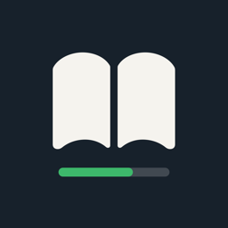
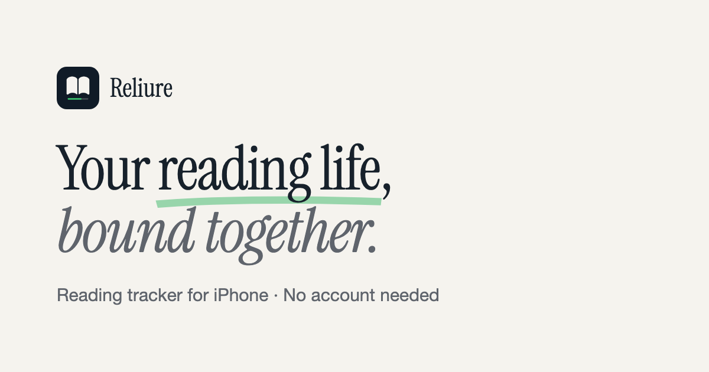

  

<h1 align="center">Reliure</h1>

<strong>Your reading life, bound together.</strong>

  Scan your books, log your pages, and see your reading grow. No account needed.

  <a href="https://reliure.me">reliure.me</a> · <a href="https://reliure.me/fr/">Français</a>

## Made for readers

Reliure is an iPhone app for keeping track of the books you read. It's built around the moments you actually read: a page update before bed, a book scanned at the shop, a quick look at where you left off. No feed, no noise, and no sign-up.

## What you can do

- **Add a book in seconds.** Scan the ISBN barcode, search by title or author, or type the ISBN yourself.
- **Keep your library in order.** To read, reading, read and wishlist, all in one place.
- **Pick up where you left off.** Your current book waits on the home screen with your page and progress.
- **Update your page in a tap.** Enter a page or a percentage, or nudge it with + and −. Every update is saved as a reading session.
- **Remember what moved you.** Notes, quotes and ratings, so a book stays with you after the last page.
- **Watch the habit grow.** Pages read, sessions and reading streaks, by week, month or year.

## Private by default

No account, no sign-up. Your library is stored on your iPhone.

## Download

Reliure is coming to the App Store for iPhone.

---

## En français

**Votre vie de lecture, reliée.**

Reliure est une app iPhone pour suivre les livres que vous lisez. Scannez vos livres, notez vos pages et voyez votre lecture grandir, sans compte.

- **Ajoutez un livre en quelques secondes** : scannez le code-barres ISBN, cherchez par titre ou auteur, ou entrez l’ISBN.
- **Reprenez là où vous en étiez** : votre livre en cours, votre page et votre progression, dès l’ouverture.
- **Mettez à jour votre page d’un geste** : chaque mise à jour devient une session de lecture.
- **Gardez vos notes et évaluations**, et suivez vos pages lues, sessions et séries de jours.

[reliure.me/fr](https://reliure.me/fr/)

---

Made with ♥ by Wibeset in Canada

